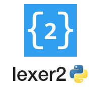

<!-- HEADER -->
<div align="center">
    <a href="https://github.com/deltarazero/liblexer2-python3">
        </a>
    <br/>
    <p>
        Flexible, ruleset-based tokenizer using regex.
    </p>
</div>

<!-- BUTTON LINKS -->
<div align="center">
    <!-- Documentation -->
    <a href="./">
        </a>
    <!-- Changelog -->
    <a href="./">
        </a>
</div>

<!-- BADGES -->
<div align="center">
    <!-- License -->
    <a href="https://choosealicense.com/licenses/zlib/">
        </a>
    <!-- Library version -->
    <a href="https://github.com/deltarazero/liblexer2-python3/tags">
        </a>
    <!-- Issues open -->
    <a href="https://github.com/deltarazero/liblexer2-python3/issues">
        </a>
    <!-- Python3 version -->
    
</div>


---


lexer2 is a library for **lexical analysis** (often called **tokenization**). lexer2 is **rule-based** in conjunction with **regular expressions (regex)** and allows for **context-based tokenization** through the (optional) use of a ruleset stack.

lexer2 is written in **pure Python (and therefore platform independent)\*** and can be easily expanded with implementations using different regex engines, all the while maintaining a **simple to use** unified interface for **implementation independent** usage.

###### *<sub>Provided that at least the default lexer implementation is available (using Python's builtin ``re`` module, implemented in C).</sub>


## Quickstart / Get Started

The recommended way to install the library is by downloading it from the Python Package Index (PyPI) through ``pip`` Python package manager:
```console
pip install liblexer2-python3
```
However, you can also manually install the library by downloading the latest release on GitHub and copying the ``lexer2`` folder to your project's includes/libraries directory.

Usage of lexer2 is relatively simple, as demonstrated by the short example below. Nonetheless, it it still encouraged to read the more in-depth example present in the documentation.

```python
import lexer2

# Define ruleset and prepare the lexer object instance
ruleset: lexer2.Ruleset_t = [
    #          Identifier     Regex pattern
    lexer2.Rule("WORD",        r"[a-zA-Z]+"),
    lexer2.Rule("NUMBER",      r"[0-9]+"),
    lexer2.Rule("PUNCTUATION", r"[.,:;!?\\-]")
]
lexer: lexer2.ILexer = lexer2.MakeLexer(ruleset=ruleset)

# Load input data by opening a file
lexer.GetTextstream().Open(r"C:/path/to/file.txt")
# Or by directly passing a string
lexer.GetTextstream().Load("This is an example!\nHopefully it works just fine.")

# Main lexing loop
token: lexer2.Token
while (1):

    # Find the next token in the textstream
    try: token = lexer.GetNextToken()
    except lexer2.excs.EndOfTextstream:
        break

    info = [
        token.GetId(),
        token.GetData(),
         "ln: {}".format(token.GetPosition().ln +1),
        "col: {}".format(token.GetPosition().col+1),
    ]
    print("{: <20} {: <20} {: <10} {: <10}".format(*info))

lexer.GetTextstream().Close()
```

```console
>>> WORD                 This                 ln: 1      col: 1
>>> WORD                 is                   ln: 1      col: 5
>>> WORD                 an                   ln: 1      col: 8
>>> WORD                 example              ln: 1      col: 11
>>> PUNCTUATION          !                    ln: 1      col: 18
>>> WORD                 Hopefully            ln: 2      col: 1
>>> WORD                 it                   ln: 2      col: 11
>>> WORD                 works                ln: 2      col: 14
>>> WORD                 just                 ln: 2      col: 20
>>> WORD                 fine                 ln: 2      col: 25
>>> PUNCTUATION          .                    ln: 2      col: 29
```


## Contributing

Contribution to this library is always welcome. The [repository is hosted on GitHub](https://github.com/deltarazero/liblexer2-python3). You can contribute by doing one of the following:

* __Submitting a pull request:__ See ["About pull requests"](https://help.github.com/articles/about-pull-requests) for more information. <br/>
_I don't recommend maintaining your own fork of the repository, but to submit pull requests instead, as this will make it less confusing for users to know which repository of the library is the most up-to-date version._
* __Submitting an issue:__ By doing this you can file a bug report or ask for a new or improved feature.


## License

(c) 2020 DeltaRazero.\
All rights reserved.

All included scripts, modules, etc. are licensed under the terms of the [zlib license](./LICENSE) unless stated otherwise in the relevant files.
